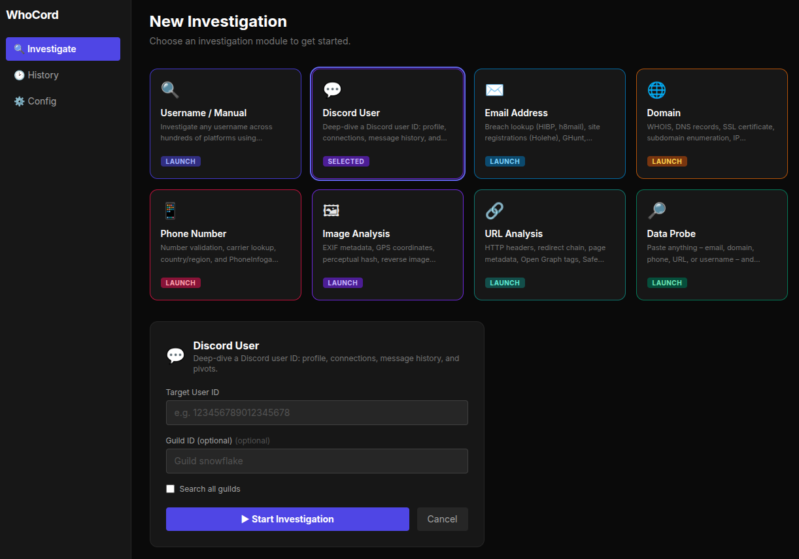

[](https://github.com/Siv-nick/WhoCord/releases)
[](LICENSE)
[](https://github.com/Siv-nick/WhoCord/stargazers)
[](#)
[](https://www.python.org/downloads/)

<p align="center">
  
</p>

# 🕵️‍♂️ WhoCord v1.1

**Turn any username, email, domain, phone number, image, URL, or probe string into a full identity profile.**

WhoCord is a modular OSINT investigation platform that runs dozens of open‑source tools, builds a knowledge graph, detects correlations, and generates an AI‑enhanced dark‑themed HTML report – all streamed live to a modern React dashboard.

---

## ⚡ Features

* **8 investigation modules** – Username / Manual, Discord, Email, Domain, Phone, Image, URL, Data Probe (auto‑detect).
* **Discord‑native link resolution** – extracts and resolves Instagram, TikTok, Facebook, and Twitter tracking links shared by a target user.
* **Full identity pipeline** – names, emails, locations, breach data, GitHub history, avatar metadata, and Google account info (GHunt).
* **Email intelligence** – Holehe (site registrations), h8mail, HIBP, EmailRep, GHunt, Blackbird email search, MOSINT (social account flags).
* **Domain investigation** – WHOIS, DNS records, SSL certificate, IP geolocation, subdomain enumeration, theHarvester.
* **Phone investigation** – number validation, carrier lookup, PhoneInfoga OSINT.
* **Image analysis** – EXIF metadata, perceptual hash, reverse image search, OCR text extraction.
* **URL analysis** – HTTP metadata, redirect trace, page metadata, Open Graph tags, Safe Browsing check, Wayback snapshot.
* **Data Probe** – paste anything (email, domain, phone, URL, username) and WhoCord auto‑detects the type.
* **Knowledge graph & correlations** – 5 detectors (avatar reuse, email‑platform cluster, username variants, name‑email link, location consistency).
* **AI‑generated reports** – LLaMA 3.3 (via Groq) produces structured narrative and persona summary.
* **Dark‑themed HTML report** – collapsible platform cards, avatar display, breach tags, pivot sub‑reports, technical data.
* **Live SSE streaming** – watch investigations in real time with stage list, finding cards, and console logs.
* **Pivot system** – recursive investigation of discovered emails/usernames with user confirmation modal.
* **Secure token storage** – API keys stored in your OS keyring, never in plain text.
* **Web dashboard** – run investigations from your browser, toggle tools, manage tokens, view history.

---

## 🚀 Quick Start (recommended)

1. **Download the portable zip** from the [Releases page](https://github.com/Siv-nick/WhoCord/releases) (Linux 64‑bit, ~500 MB).
2. **Extract** the archive anywhere:
   ```bash
   unzip WhoCord.zip -d WhoCord
   ```
3. **Run the web dashboard**:
   ```bash
   cd WhoCord
   ./run.sh
   ```
   *(opens your browser automatically)*

**No Python, pip, or tool installation is required** – everything is bundled inside.

---

## 📦 Installation (from source – for developers)

### 1. Clone the repository
```bash
git clone https://github.com/jebat8101/WhoCord.git
cd WhoCord
```

### 2. Create a Python virtual environment
```bash
python3 -m venv venv
source venv/bin/activate   # Linux / macOS
```

### 3.Install dependencies
Use the pinned file (recommended):
```bash
pip install -r requirements.txt
```
### 4. Install WhoCord and its Python dependencies
```bash
pip install -e .
```

### 5. Install external command‑line tools (most via pip)

All required tools can be installed with a single `pip install` command:

```bash
# Username search tools
pip install sherlock-project maigret naminter linkook

# Email intelligence tools
pip install holehe h8mail theHarvester

# GitHub & Google tools
pip install gitfive ghunt

# Phone & image analysis
pip install phoneinfoga pillow imagehash pytesseract

# Domain investigation
pip install dnspython
```

### 5. Install Blackbird (email & username search on 600+ sites)
```bash
git clone https://github.com/p1ngul1n0/blackbird
cd blackbird
pip install -r requirements.txt
cd ..
```
> The required data file (`wmn-data.json`) is auto‑downloaded on first use. If that fails, download it manually from [WhatsMyName](https://raw.githubusercontent.com/WebBreacher/WhatsMyName/main/wmn-data.json) and place it in `blackbird/data/`.

### 6. Install system WHOIS (required for domain investigations)
```bash
sudo apt install whois          # Debian/Ubuntu
# brew install whois            # macOS
```

### 7. (Optional) Authenticate GHunt for Google account intelligence
```bash
ghunt login
```
Follow the instructions to authenticate with your Google account.

### 8. Build the frontend (required for source installations)

The web dashboard requires a compiled React frontend. Make sure you have **Node.js 18+** and **npm** installed, then run:

```bash
cd frontend
npm install
npm run build
cd ..
```

This creates the `frontend/dist/` folder that Flask serves automatically.

### 9. Launch the web dashboard
```bash
python web_app.py
```
Then open `http://127.0.0.1:5000`.  
Or use the one‑click launcher: `./run.sh`.

<p align="center">  </p>

---

## 🚀 Usage

### Web Dashboard (primary interface)

The dashboard offers eight investigation modules:

| Module | Input | Tools run |
|--------|-------|------------|
| **Username / Manual** | username (optional email) | Sherlock, Maigret, Blackbird, Naminter, Linkook, Sociopath, scraping, analysis, intelligence, email tools |
| **Discord User** | user ID + guild ID | Discord profile fetch, message crawling, tracking‑link resolution |
| **Email Address** | email | Holehe, h8mail, HIBP, EmailRep, GHunt, SMTP, Gravatar, Scylla, Blackbird email, MOSINT |
| **Domain** | domain | WHOIS, DNS, SSL, IP geolocation, subdomain enumeration, theHarvester |
| **Phone Number** | phone | phonenumbers library, carrier lookup, PhoneInfoga |
| **Image Analysis** | image URL | EXIF, perceptual hash, reverse search, OCR |
| **URL Analysis** | URL | HTTP meta, redirects, page metadata, Open Graph, Safe Browsing, Wayback |
| **Data Probe** | any string | auto‑detects type and runs the appropriate module |

**Live investigation page** shows:
- Stage list with real‑time status
- Finding cards (emails, names, breaches, correlations)
- Console logs (raw tool output)
- Pivot confirmation modal (when enabled)

**History page** – list all past investigations with links to reports and JSON intel.

**Config page** – manage API tokens, toggle tools, set pivot options, upgrade tools.

### Interactive menu (legacy CLI)

```bash
discord-osint
```

Then use the numbered menu to toggle tools, set tokens, and start investigations.

### Command‑line mode (limited to manual/discord)
```bash
discord-osint --mode manual --target someusername --output html --debug
```

---

## 📁 Output files

All results are saved in **`investigation_cache/`**:

| File | Description |
|---|---|
| `intel_*.json` | Complete intelligence snapshot (structured JSON) |
| `report_*.md` | AI‑generated markdown report (if Groq enabled) |
| `report_*.html` | Interactive dark‑themed HTML report |
| `blackbird_output/` | Raw Blackbird JSON results |
| `socialscan_output/` | Socialscan results |
| `debug_*.log` | Detailed debug logs (when debug mode is on) |

### HTML report sections
- Identity (Discord handle, name clues, location, language, confidence scores)
- Persona Summary (AI)
- Social Profiles (collapsible platform cards with avatars, bios, extra fields)
- Email Intelligence (breach tags, MOSINT flags)
- Intelligence Analysis (graph stats, narrative, correlations)
- Pivot Sub‑Investigations
- Technical Data (WHOIS, DNS, SSL, IP geolocation, subdomains, theHarvester, phone, URL analysis, GHunt)

---

## 🛠️ Tools & technologies

WhoCord integrates these open‑source OSINT projects:

| Category | Tools |
|----------|-------|
| **Username search** | Sherlock, Maigret, Blackbird, Naminter, Linkook, Sociopath, Social Analyzer, Toutatis |
| **Email intelligence** | Holehe, h8mail, HIBP, EmailRep, GHunt, MOSINT, Scylla, Gravatar, SMTP verification |
| **Domain & DNS** | WHOIS (system), dnspython, theHarvester, sublist3r (fallback wordlist) |
| **Phone** | phonenumbers, PhoneInfoga, AbstractAPI (free) |
| **Image** | Pillow, imagehash, exifread, SauceNAO (reverse image), Tesseract OCR |
| **URL** | requests, BeautifulSoup, Google Safe Browsing, Wayback Machine |
| **Intelligence** | networkx, socid‑extractor, Groq (LLaMA 3.3) |
| **Web dashboard** | Flask, React, TypeScript, Tailwind CSS, SSE |

---

## 🔄 Updates

Check [CHANGELOG.md](CHANGELOG.md) for version history.

---

## 🔒 Security & privacy

- **Tokens are never stored in plain text** – kept in your OS keyring.
- `config.json` only contains non‑sensitive toggles.
- All investigation data stays on your machine inside `investigation_cache/`.

---

## ⚠️ Disclaimer

WhoCord is intended for **educational purposes** and **authorised security testing** only.  
Do not use it to stalk, harass, or violate anyone’s privacy.  
The author assumes no liability for misuse.

---

## 📄 License

MIT License
